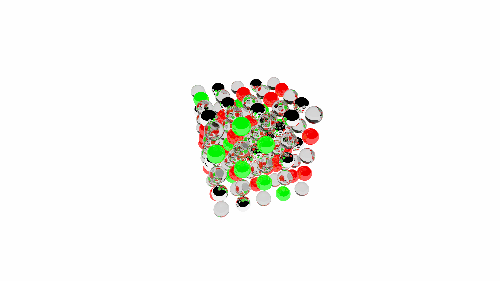
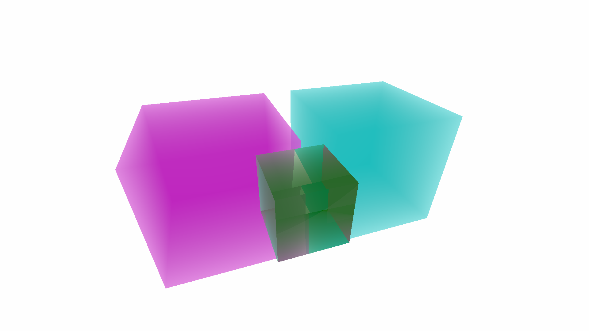
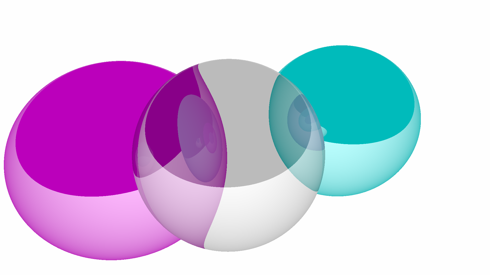
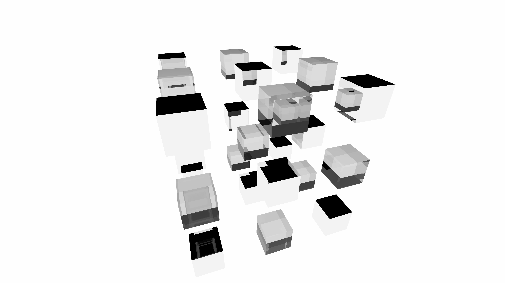

This project is a rendering engine that attempts to reproduce realistic imagery by simulating individual light rays, following them along a path. It currently models some basic physical material properties, such as transparency, emittance, and refractive properties, with more planned. The program currently generates still images using CPU-only rendering, features basic BVH optimization. I am planning to optimize the rendering process further, and might add GPU parallelization in the future, which would make the rendering process considerably faster.

    
    
    
    

More images generated by this program can be found under [./example-images](./example-images).

NOTE: The purpose of this project is not only to learn about optics and rendering, but also to teach myself about C++ and writing good low-level code. Therefore, I have decided to implement a lot of the math and memory structures myself; things that would normally be left to a third-party library. This means that some parts of the program may not be as optimized as they could be.

# How to use

This project is currently not very user-friendly, and rendering instructions can only be given in code. A scene is set up by first defining a set of `Material`s and `SceneObject`s, which are added to a `Scene`. The scene is rendered by instantiating a `RenderBuffer` and passing the camera view-point and orientation in the form of a 4x4 transformation matrix (`Matrix4x4`) together with the desired field-of-view. The functionality defined in `main.cpp` also times the rendering process and outputs an image file to `./out`.

# Features

The renderer currently supports rendering arbitrary meshes, as well as some primitive shapes, although support for the latter may be dropped in the future for performance. Each object has to be assigned a material, the properties of which are described below. Currently, the program simulates refraction and translucency, simulating multiple internal reflections and refractions. 

## Material properties
| Property           | Explanation                                                                                                                                                                 |
|--------------------|-----------------------------------------------------------------------------------------------------------------------------------------------------------------------------|
| Roughness          | Value between 0 and 1. Determines how much light is refracted/reflected vs absorbed/emitted. High roughness = lots of absorbed light, lots of emitted light is allowed out. |
| Attenuation length | -1 if the material doesn't let light through. Otherwise, determines the travel length at which light is attenuated by a factor of 1/e.                                      |
| Transparency       | Boolean value. If true, light is refracted/reflected according to the Fresnel equations. Otherwise all light is reflected.                                                  |
| Refractive index   | Non-negative value. Determines the speed of light in the material, compared to in air. Values below 1 indicate that light speeds up in the material.                        |
| Emittance          | Frequency spectrum. Determines how much light the material emits at each frequency.                                                                                         |

# Planned features
This is a list of features that are not necessarily being worked on right now, but that I would like to implement at some point.

| Feature                      | Category         | Priority | Note/explanation                                                                                                                                                                                                                                                                     |
|------------------------------|------------------|----------|--------------------------------------------------------------------------------------------------------------------------------------------------------------------------------------------------------------------------------------------------------------------------------------|
| Diffuse materials            | Materials        | High     | Simulation of lambertian diffuse reflectance.                                                                                                                                                                                                                                        |
| GPU parallelization          | Optimization     | High     | Run rendering code on the GPU, presumably using either Vulkan or CUDA.                                                                                                                                                                                                               |
| Light frequency              | Light properties | Medium   | Allow for light rays to store information about its frequency distribution. This feature would probably result in a significant performance hit, but is required to simulate dispersion and absorption, among other phenomena.                                                       |
| Dispersion                   | Materials        | Medium   | Frequency-dependent refractive indices.                                                                                                                                                                                                                                              |
| Absorption                   | Materials        | Medium   | Light absorption within a material, and absorption spectra that vary over different wavelengths. This is required for giving objects colors without colored emittance.                                                                                                               |
| Light polarization           | Light properties | Medium   | Allow for light rays to store information about the polarization state, presumably using Stokes parameters and Mueller calculus. Add polarization filters and simulate reflected light polarization.                                                                                 |
| Animation / video generation | I/O              | Medium   | Some kind of system that allows for the camera, and potentially objects in the scene, to move. This would entail a large overhaul of the memory structure used for storing objects in the scene, as that memory structure would have to be continuously updated when moving objects. |
| Full .obj support            | Scene objects    | Low      | Add support for more .obj file properties, and loading custom materials from .mtl files.                                                                                                                                                                                             |
| Diffraction                  | Light properties | Low      | Simulation of diffraction gratings.                                                                                                                                                                                                                                                  |
| Birefringence                | Materials        | Low      | Simulation of birefringent materials.                                                                                                                                                                                                                                                |
| Thin-film interference       | Materials        | Low      | Simulation of interference in material with thin-layer surfaces.                                                                                                                                                                                                                     |
| Subsurface scattering        | Light transport  | Low      | Simulation of internal diffuse light scattering.                                                                                                                                                                                                                                     |
| Color blindness simulation   | Dynamic effects  | Low      | Filter that simulates how light would be perceived by a human eye, or in particular, a color blind human eye.                                                                                                                                                                        |
| Light/dark adaptation        | Dynamic effects  | Low      | Simulation of light adaptation in a human eye suddenly exposed to a higher light intensity, using the theory of photopic/scotopic vision.                                                                                                                                            |
| UI                           | I/O              | Low      | Some kind of UI to allow the user to customize the scene and materials used in rendering without having to code.                                                                                                                                                                     |
